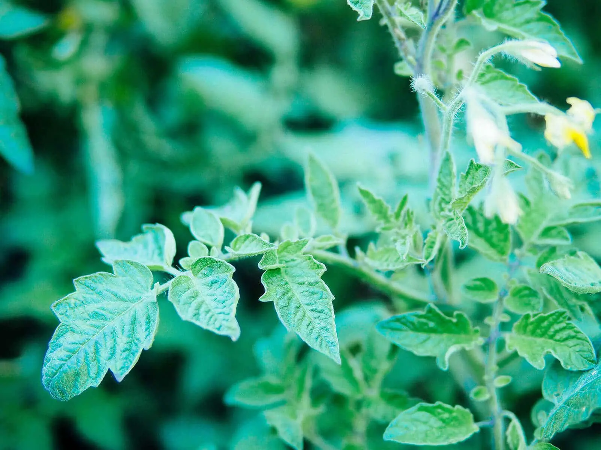
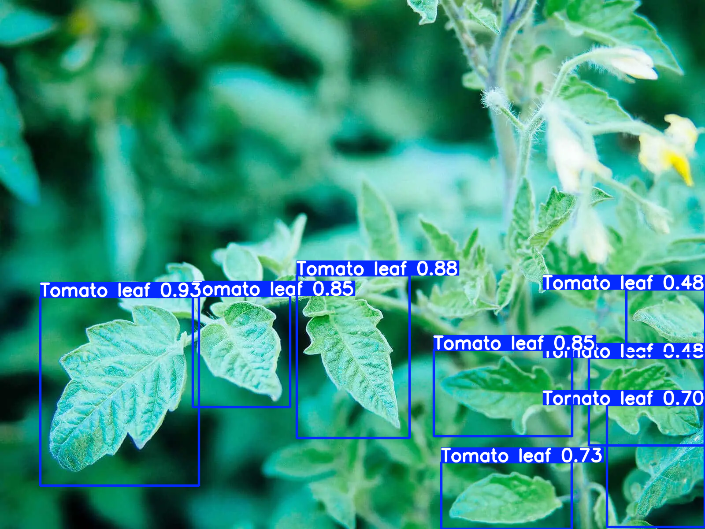

#  YOLOv8 ile Saha Koşullarında Uçtan Uca Bitki Türü Tanımlama ve Sınıflandırma Sistemi

Bu proje; tarla, sera ve doğal yaşam alanları gibi gerçek dünya koşullarında çekilen karmaşık arka planlı fotoğraflardan, derin öğrenme tabanlı nesne tespiti mimarisi kullanılarak doğrudan yaprak morfolojisi üzerinden **bitki türünü** (Mısır, Elma, Domates vb.) yüksek doğrulukla tahmin edebilen optimize bir sistemdir.

##  Öne Çıkan Özellikler
- **Doğrudan Bitki Türü Odağı:** Hastalık lekeleri, gürültüler veya arka plandaki yabani otlara takılmaksızın, doğrudan ana yaprağın karakteristik özelliklerinden bitki sınıfını ayırt eder.
- **Uçtan Uca (End-to-End) Mimari:** Geleneksel iki aşamalı (YOLO ile yaprağı kesip ardından ikinci bir CNN ile sınıflandırma) hantal modellerin aksine, tek bir optimize **YOLOv8** modeliyle hem bitkinin konumunu belirler hem de türünü aynı anda tahmin eder.
- **Saha Tipi Optimizasyon:** Gerçek zamanlı mobil/saha uygulamalarına entegre edilmeye uygun, son derece düşük gecikme süreli (low latency) çıkarım (inference) yeteneği.

---

##  Örnek Çıktılar ve Test Sonuçları
Sistemin saha koşullarında, karmaşık arka planlar altındaki bitki türü tanımlama performansını gösteren test çıktıları aşağıda yer almaktadır:

| Test Senaryosu (Girdi Görseli) | Test Sonucu (Uçtan Uca Bitki Türü Tahmini) |
| :---: | :---: |
|  |  |

> **Not:** Model, yaprak damar ve form yapılarını analiz ederek yüksek güven oranıyla (`conf=0.25+`) bitki etiketlemesini gerçekleştirmektedir.

---

##  Kurulum ve Çalıştırma

### 1. Gereksinimlerin Yüklenmesi
Projeyi yerel bilgisayarınızda veya sunucunuzda çalıştırmak için gerekli kütüphaneleri yükleyin:
```bash
pip install -r requirements.txt
